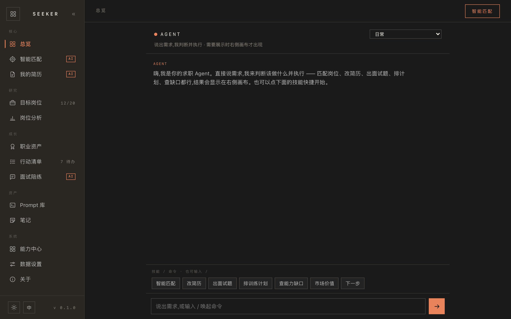
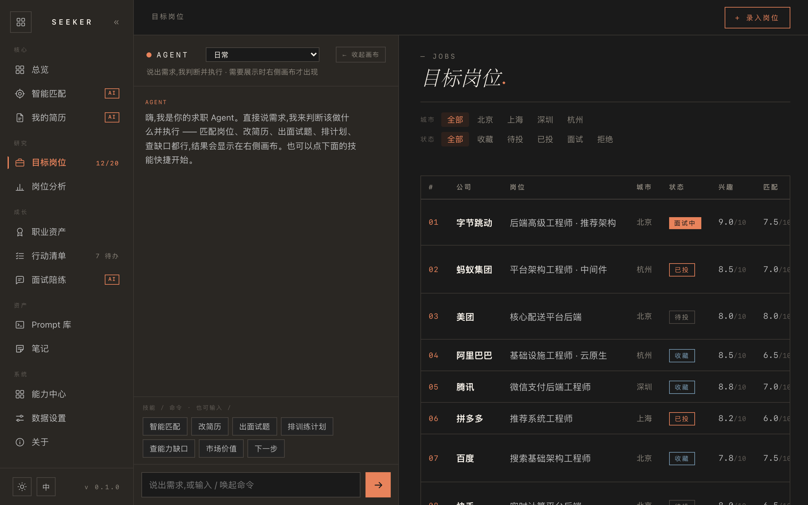
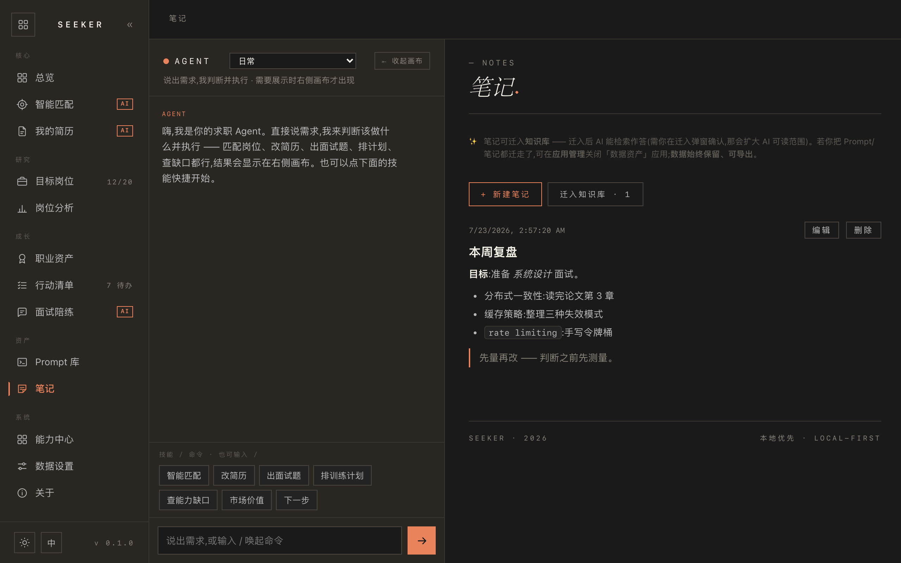

# 探索者 · Seeker

> **本地优先的个人 AI Agent 平台** —— 一个壳,N 个可开关的小应用。数据存本地,密钥只进系统钥匙串,隐私信息永不参与 AI 处理。
>
> *Seeker is a local-first personal AI agent platform — a shell plus toggleable mini-apps. Your data stays on your machine, API keys live only in the system keychain, and private info never goes through AI.*

对话即入口:说出需求,Agent 判断该做什么并执行 —— 查你的数据、出结构化卡片、跑你沉淀的技能;需要展示时右侧画布才出现。找完工作可以关掉求职应用,数据保留 —— 平台还是你的平台。



| 对话 + 画布分屏(演示数据) | 笔记 · Markdown |
| --- | --- |
|  |  |

## 特性

- **Agent-native** —— Agent 窗口即入口,一切功能皆工具;斜杠命令面板 + 快捷 chips + 项目工作区(每个项目独立对话线与定制指令)
- **能力中心(全真,无 mock)** —— 连接器(MCP 本地/远程)· 应用工具 · 记忆 · 知识库 · Skills(自建/导入/工具限定)· 定时任务 · 项目,统一查看与管理
- **多应用平台** —— 壳 + manifest 注册的小应用,可开关、可排序;关应用 = UI/AI 即刻下架、数据保留。内置:求职工作台(智能匹配 / 简历 / 面试陪练 / 市场价值)、数据资产(Prompt 库 / 笔记,支持 Markdown)
- **BYO 多协议 AI** —— OpenAI 兼容 / Anthropic / Gemini / Ollama(本地免费),自带 Key、自选模型;前端只发文字收 token 流
- **本地优先** —— 桌面 SQLite / 网页 IndexedDB;联网只为调用你自填的模型端点
- **中英双语 · 深浅主题**

## 安全模型(不是口号,是结构)

| 红线 | 落点 |
|---|---|
| 密钥只进系统钥匙串 | 前端/库/日志永远只见 `configured/empty` |
| 隐私字段 AI 永不可读 | `profile` 独立存储,类型层面无「导出给 AI」路径;静态 `QUERYABLE` 硬底 |
| 应用数据 AI 可读三层闸 | 应用启用 ∩ manifest 默认 ∩ 用户逐应用授权,强制点在能力层 invoke(非提示层暗示) |
| 破坏性操作 | 模型只能提议,执行须用户显式确认;预览 + 确认 + **真撤销**(快照完整性结构保证) |
| 不可信内容防注入 | RAG / MCP / 外部文本一律 `Untrusted` 框定;LLM 生成 UI 走 iframe sandbox + CSP |
| AI 不能自我持续 | 不能给自己排定时任务、不能改项目指令、设置不能经对话修改 —— 通路结构性缺席 |

## 快速开始

**🌍 官网**:**[seeker.aklman.com](https://seeker.aklman.com/)**

**🌐 在线体验(免安装)**:**[aklmans.github.io/seeker](https://aklmans.github.io/seeker/)** —— Web 演示版,数据只存你的浏览器;真实 AI / 记忆 / 连接器在桌面端。

**桌面(macOS / Windows)**:从 [Releases](../../releases) 下载 `.dmg` / `-setup.exe` 安装。首次打开的系统提示(macOS 右键打开 / Windows SmartScreen「仍要运行」)见 [QUICKSTART](docs/QUICKSTART.md)。

**首跑三步**:数据设置 → 模型配置 → 填入你的 API Key(或本地 Ollama,零成本)。支持 OpenAI 兼容端点 / Anthropic / Gemini / Ollama。详细路径与免费方案见 **[docs/QUICKSTART.md](docs/QUICKSTART.md)**。

## 从源码构建

前置:Rust ≥ 1.77.2 · Node ≥ 20

```bash
npm install
npm run build:all        # 产出 .app / .dmg(src-tauri/target/release/bundle/)
# 开发:cd src-tauri && cargo run
npm test                 # 单元测试
npm run typecheck        # tsc
```

## 架构

```
web/
├── platform/        # 平台层(稳定 · 业务无关):壳/契约/AI 网关/能力层/护栏/安全渲染
└── apps/            # 小应用层(互不 import,只经 SeekerShell.* 契约与壳通信)
    ├── jobseek/     #   求职工作台
    └── assets/      #   数据资产(Prompt 库 / 笔记)
src-tauri/           # Rust 核:SQLite · 钥匙串 · AI 工具循环 · MCP · 能力 registry
```

技术栈:**Tauri 2**(Rust + 系统 WebView)· 原生 HTML/CSS/JS(**无前端框架**)· SQLite / IndexedDB。
新增一个应用 ≈ 一个目录 + 一份 manifest,平台零改动。

## 反馈

试用中的任何感受都欢迎 —— 尤其是「哪里卡住了」「哪里没想明白」。请开 [Issue](../../issues) 或按 [FEEDBACK 模板](docs/FEEDBACK.md) 留言。

## 联系作者

| | |
|---|---|
| **X / Twitter** | [@ak_zhaphar](https://x.com/ak_zhaphar) |
| **Email** | hi@zhaphar.com |
| **微信** | 扫下方二维码 |


## License

[MIT](LICENSE) © 2026 Zhaphar
