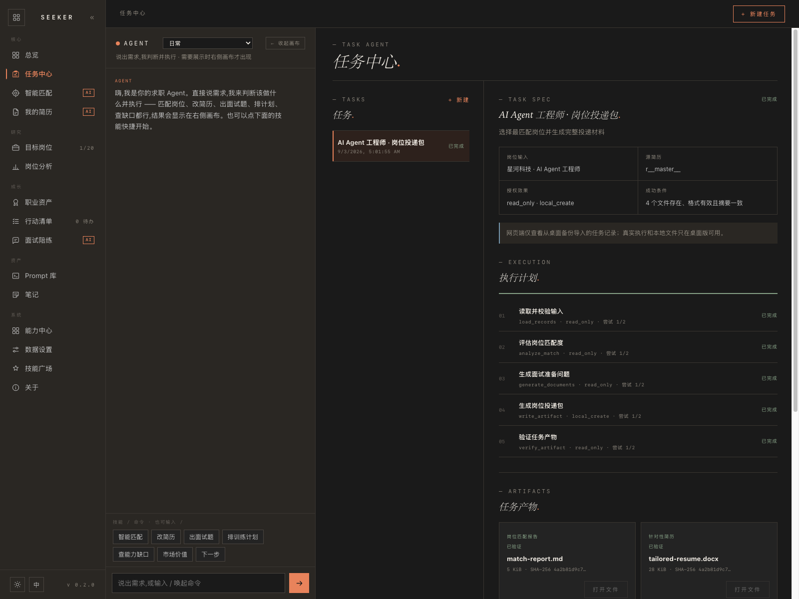
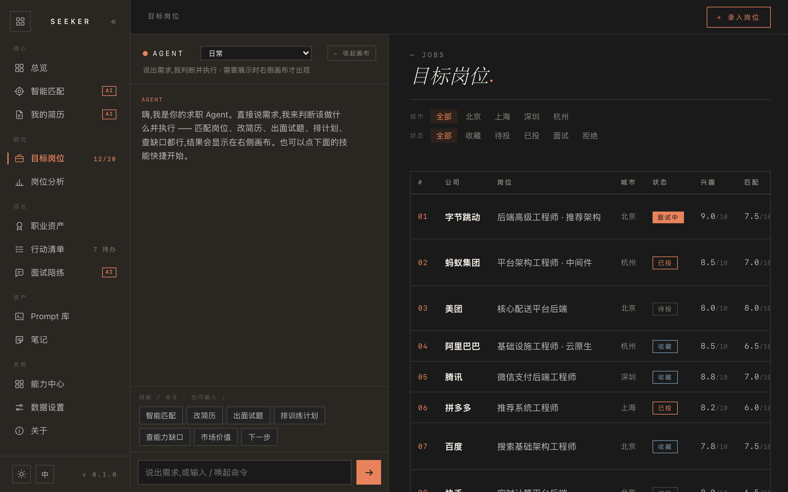
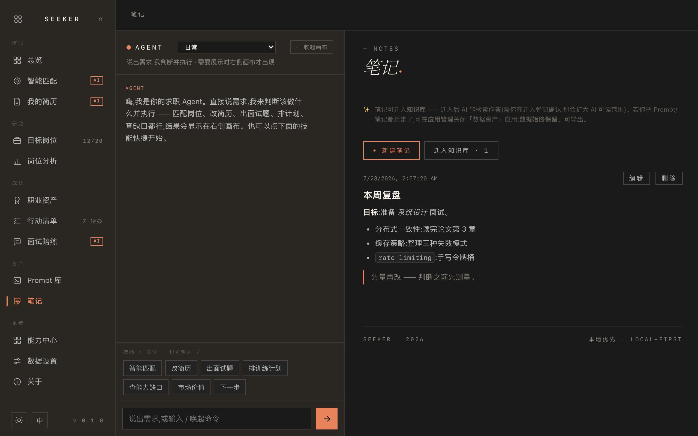

# 探索者 · Seeker

> **本地优先的日常 AI 助手。** 提问、写作翻译、阅读文件、保存资料，也能把选中的几份资料整理成报告；数据默认保存在本机，模型和能力由你选择。
>
> *A local-first everyday AI assistant for chat, writing, file reading, notes and reports from selected materials. You choose the models and capabilities.*

**v0.2.0：** 首个完整任务闭环是“岗位投递包”。选择 1–5 个岗位与一份专业简历后，Seeker 会按受控步骤选择最匹配岗位，生成匹配报告、针对性简历、求职信和面试清单，并在全部文件通过完整性验证后才宣告完成。

**v0.3.0：机会雷达。** 你可以选择固定招聘页，或在手动运行时明确授权一个兼容的 MCP 查询工具，设置职位、职级、地点、远程偏好、技能和排除词；Seeker 会受控检索、硬筛选、逐条验链、确定性去重评分，将结果放进独立待审队列并生成真实报告。只有你明确接受后，候选才会进入目标岗位；无人值守计划只允许固定招聘页。

**v0.4.0：日常助手与可编辑作品。** 新增通用首页、可恢复独立会话、写作工具、本地资料库、TXT/MD/PDF/DOCX 阅读和资料整理助手；加入工作空间、可开关求职应用，以及可编辑的知识卡片、思维导图、对比表和时间线。作品支持个人样式、历史版本、图片/PDF/离线 HTML 导出与受限 AI 编辑。完整工程验收见 [第一轮验收](docs/ROUND-1-ACCEPTANCE.md) 与 [第二轮验收](docs/ROUND-2-ACCEPTANCE.md)。

[下载桌面版](https://github.com/aklmans/seeker/releases/latest) · [在线体验](https://aklmans.github.io/seeker/) · [快速开始](docs/QUICKSTART.md)



<sub>任务中心截图使用专门构造的演示数据。Web 端可查看导入记录；真实执行、产物预览和本地文件操作在桌面版完成。</sub>

| 对话 + 画布分屏(演示数据) | 笔记 · Markdown |
| --- | --- |
|  |  |

## 为什么是 Seeker

- **真正执行的任务 Agent** —— 任务先明确输入、权限和成功条件，再按可恢复步骤运行；暂停、继续、取消和退出恢复都有可信状态，不靠模型自述“已经完成”
- **机器验证的真实产物** —— 岗位投递任务生成 2 个 DOCX + 2 个 Markdown；文件格式、大小和 SHA-256 全部复验通过后才算成功
- **机会雷达与待审队列** —— 对用户选择的来源做有界搜索和 Rust 验链，候选先去重评分、保留来源与发现时间，再由用户逐条接受或拒绝
- **对话与任务双入口** —— 对话适合查询、调用技能和即时操作；需要持续执行、生成产物的工作进入任务中心，由 Rust 状态机管理
- **本地优先与明确授权** —— 桌面数据存入 SQLite，Web 数据存入 IndexedDB；只有用户主动配置或触发的模型、连接器和网页能力会访问网络
- **统一能力中心** —— 管理本地/远程 MCP、应用工具、记忆、知识库、Skills、定时任务和项目；不可用能力明确降级，不伪装成功
- **模块化业务应用** —— 应用通过 manifest 注册，可开关、可排序；关闭应用会立即撤下对应 UI 和 AI 能力，但保留本地数据
- **BYO 多协议 AI** —— 支持 OpenAI-compatible、Anthropic、Gemini 与 Ollama，自带 Key、自选模型
- **中英双语 · 深浅主题**

> **当前边界：** 开发版开放“资料整理助手”“岗位投递包”和“机会雷达”三条编译期固定任务流。首轮桌面内测仍需自带模型，没有托管订阅、图片 OCR、任意 Shell、任意文件写入、多 Agent、自由 DAG、自动投递或外部承诺动作。

## 安全模型(不是口号,是结构)

| 红线 | 落点 |
|---|---|
| 密钥只进系统钥匙串 | 前端、数据库和日志永远只见 `configured/empty` |
| 隔离隐私字段 AI 永不可读 | `profile` 独立存储，类型层面无“导出给 AI”路径；静态 `QUERYABLE` 硬底 |
| 业务数据必须授权 | 应用启用 ∩ manifest 默认 ∩ 用户逐应用授权，强制点在能力层 invoke，而不是提示词暗示 |
| 破坏性操作 | 模型只能提议，执行须用户显式确认；预览 + 确认 + **真撤销** |
| 不可信内容防注入 | RAG、MCP、岗位描述和外部文本一律按 `Untrusted` 数据处理；模型生成 UI 进入 iframe sandbox + CSP |
| AI 不能自我持续 | 不能给自己排定时任务、不能改项目指令，设置不能经对话修改 —— 通路结构性缺席 |

## 快速开始

**🌍 官网：** [seeker.aklman.com](https://seeker.aklman.com/)

**🌐 在线体验（免安装）：** [aklmans.github.io/seeker](https://aklmans.github.io/seeker/) —— Web 演示数据保存在浏览器中；任务执行、本地文件、系统钥匙串和完整连接器能力在桌面版提供。

**桌面版：** 从 [Releases](https://github.com/aklmans/seeker/releases/latest) 下载最新公开版本。

**首次连接：** 首页 → 连接模型 → 填写并保存测试（本地 Ollama 无需 Key）。完整操作见 [快速开始](docs/QUICKSTART.md)。

## 从源码构建

前置：Node.js ≥ 20；Rust 版本由 [`rust-toolchain.toml`](rust-toolchain.toml) 自动固定。

```bash
npm ci
npm run build:all        # 构建当前平台的桌面安装包
# 开发：cd src-tauri && cargo run
npm test                 # 单元测试
npm run typecheck        # tsc
npm run test:e2e         # Playwright Chromium + WebKit（首次先安装这两个浏览器）
```

## 架构

```
web/
├── platform/        # 平台运行时层：契约 / AI 网关 / 能力层 / 护栏 / 安全渲染
└── apps/            # 业务应用层：互不 import，只通过 SeekerShell.* 契约通信
    ├── jobseek/     #   求职工作台
    ├── assets/      #   资料库、文件阅读和资料整理任务
    └── daily/       #   日常文字工具
src-tauri/           # Rust 核：SQLite · 钥匙串 · AI 工具循环 · MCP · 能力 registry
```

技术栈：**Tauri 2**（Rust + 系统 WebView）· 原生 HTML/CSS/JavaScript（无前端框架）· SQLite / IndexedDB。
新增一个应用约等于增加一个目录和一份 manifest，平台运行时无需随之改动。
运行时、数据所有权、AI 协议矩阵与扩展检查表见 [架构文档](docs/ARCHITECTURE.md)。
Task Agent 的状态机与安全边界见 [Task Agent 契约](docs/AGENT-TASKS.md)，岗位投递包体验验收见 [v0.2 验收手册](docs/AGENT-TASKS-ACCEPTANCE.md)，机会雷达的权限、数据与验收矩阵见 [v0.3 机会雷达契约](docs/OPPORTUNITY-RADAR.md)。

## 反馈

试用中的任何感受都欢迎 —— 尤其是“哪里卡住了”“哪里没想明白”。请开 [Issue](https://github.com/aklmans/seeker/issues) 或按 [FEEDBACK 模板](docs/FEEDBACK.md) 留言。

## 联系作者

| | |
|---|---|
| **X / Twitter** | [@ak_zhaphar](https://x.com/ak_zhaphar) |
| **Email** | hi@zhaphar.com |
| **微信** | 扫下方二维码 |


## License

[MIT](LICENSE) © 2026 Zhaphar
