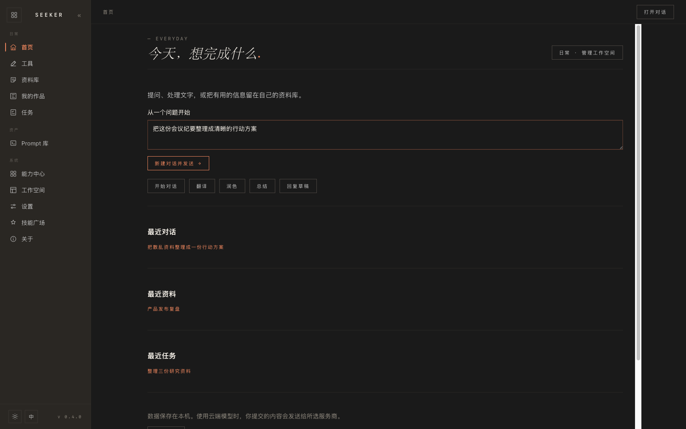
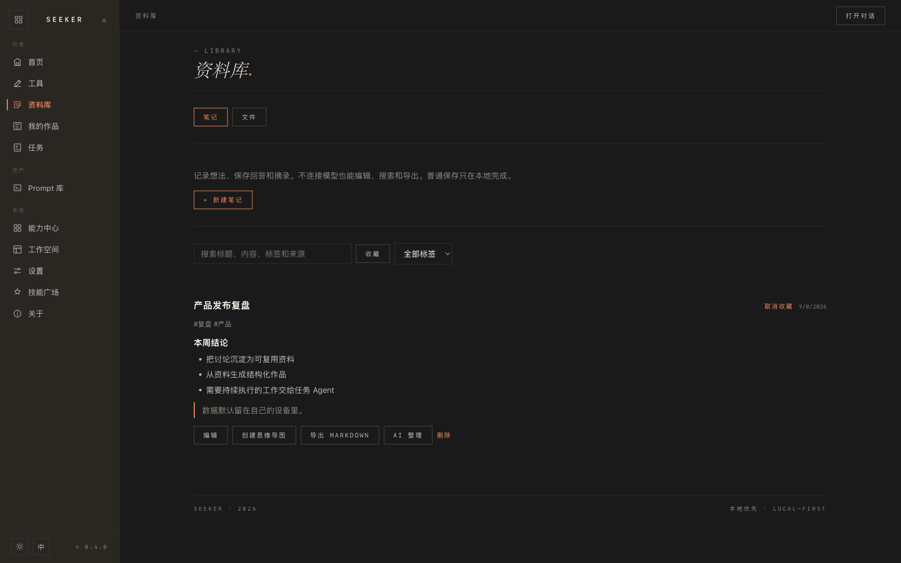
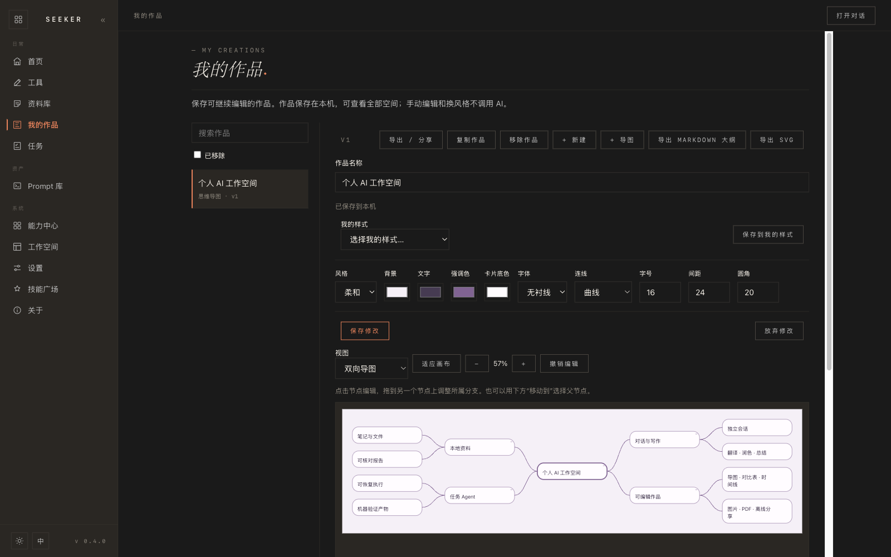
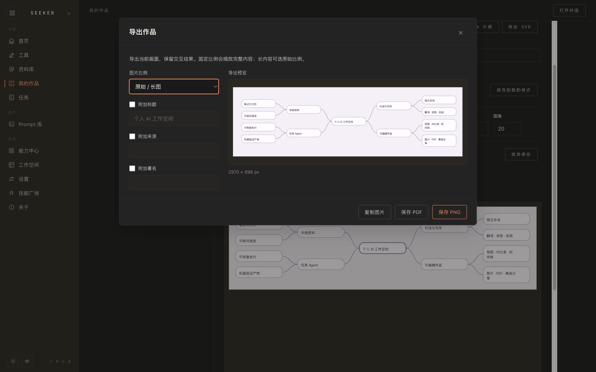

# 探索者 · Seeker

> **本地优先的个人 AI 工作空间。** 在独立对话中思考和写作，把文件与笔记沉淀为自己的资料，再整理成可继续编辑、导出和分享的作品；需要持续执行的工作交给可恢复、可验证的任务 Agent。
>
> *A local-first personal AI workspace for conversations, writing, files, notes, editable creations, and resumable task agents. You choose the models and capabilities.*

Seeker 不是围绕单一场景组织的“求职工作台”，也不只是一个聊天窗口。当前产品由四个彼此衔接的层次组成：

- **对话与写作**：独立会话、翻译、润色、总结，以及对选中文件的问答
- **本地资料**：统一管理笔记和文件，明确选择哪些正文可以交给模型
- **可编辑作品**：把内容变成知识卡片、思维导图、对比表和时间线，继续编辑、换风格、留版本并导出
- **任务 Agent**：把多步骤工作交给受控状态机执行，支持暂停、继续、取消、退出恢复和机器验证

**v0.4.1** 已包含上述个人工作空间主线，以及工作空间配置、数据管理、能力中心和可开关的求职应用。完整工程验收见 [第一轮验收](docs/ROUND-1-ACCEPTANCE.md) 与 [第二轮验收](docs/ROUND-2-ACCEPTANCE.md)。

[下载桌面版](https://github.com/aklmans/seeker/releases/latest) · [在线体验](https://aklmans.github.io/seeker/) · [快速开始](docs/QUICKSTART.md)



<sub>截图使用专门构造的演示数据。桌面版提供完整的文件、任务和连接器能力；在线体验会明确标注不可用的桌面能力。</sub>

| 本地资料库 | 可编辑思维导图 |
| --- | --- |
|  |  |



## 为什么是 Seeker

- **围绕内容流转，而不是围绕聊天框** —— 对话可以沉淀为资料，资料可以生成作品；作品继续编辑、留版本、导出和分享
- **真正执行的任务 Agent** —— 多步骤工作先明确输入、权限和成功条件，再按可恢复步骤运行；暂停、继续、取消和退出恢复都有可信状态
- **机器验证的真实产物** —— 任务结果写入真实文件并校验格式、大小和 SHA-256，不靠模型自述“已经完成”
- **自己的资料上下文** —— 笔记、TXT、Markdown、PDF 和 DOCX 保存在本地，问答和整理只发送用户明确选择的正文
- **工作空间与可选应用** —— 先选择适合自己的入口和能力；求职等垂直应用默认关闭，需要时再启用，关闭也不删除数据
- **本地优先与明确授权** —— 桌面数据存入 SQLite，Web 数据存入 IndexedDB；只有用户主动配置或触发的模型、连接器和网页能力会访问网络
- **统一能力中心** —— 管理本地/远程 MCP、应用工具、记忆、知识库、Skills、定时任务和项目；不可用能力明确降级，不伪装成功
- **模块化业务应用** —— 应用通过 manifest 注册，可开关、可排序；关闭应用会立即撤下对应 UI 和 AI 能力，但保留本地数据
- **BYO 多协议 AI** —— 支持 OpenAI-compatible、Anthropic、Gemini 与 Ollama，自带 Key、自选模型
- **中英双语 · 深浅主题**

> **当前边界：** 桌面版需要自带模型；任务 Agent 当前开放“资料整理助手”“岗位投递包”和“机会雷达”三条编译期固定流程。求职应用是可选场景，不代表 Seeker 的产品边界。当前没有托管订阅、图片 OCR、任意 Shell、任意文件写入、多 Agent、自由 DAG、自动投递或外部承诺动作。

## 安全模型(不是口号,是结构)

| 红线 | 落点 |
|---|---|
| 密钥只进系统钥匙串 | 前端、数据库和日志永远只见 `configured/empty` |
| 隔离隐私字段 AI 永不可读 | `profile` 独立存储，类型层面无“导出给 AI”路径；静态 `QUERYABLE` 硬底 |
| 业务数据必须授权 | 应用启用 ∩ manifest 默认 ∩ 用户逐应用授权，强制点在能力层 invoke，而不是提示词暗示 |
| 破坏性操作 | 模型只能提议，执行须用户显式确认；预览 + 确认 + **真撤销** |
| 不可信内容防注入 | RAG、MCP、岗位描述和外部文本一律按 `Untrusted` 数据处理；模型生成 UI 进入 iframe sandbox + CSP |
| AI 不能自我持续 | 不能给自己排定时任务、不能改项目指令，设置不能经对话修改 —— 通路结构性缺席 |

## 快速开始

**🌍 官网：** [seeker.aklman.com](https://seeker.aklman.com/)

**🌐 在线体验（免安装）：** [aklmans.github.io/seeker](https://aklmans.github.io/seeker/) —— Web 演示数据保存在浏览器中；任务执行、本地文件、系统钥匙串和完整连接器能力在桌面版提供。

**桌面版：** 从 [Releases](https://github.com/aklmans/seeker/releases/latest) 下载最新公开版本。

**首次连接：** 首页 → 连接模型 → 填写并保存测试（本地 Ollama 无需 Key）。完整操作见 [快速开始](docs/QUICKSTART.md)。

## 从源码构建

前置：Node.js ≥ 20；Rust 版本由 [`rust-toolchain.toml`](rust-toolchain.toml) 自动固定。

```bash
npm ci
npm run build:all        # 构建当前平台的桌面安装包
# 开发：cd src-tauri && cargo run
npm test                 # 单元测试
npm run typecheck        # tsc
npm run test:e2e         # Playwright Chromium + WebKit（首次先安装这两个浏览器）
```

## 架构

```
web/
├── platform/        # 平台运行时层：契约 / AI 网关 / 能力层 / 护栏 / 安全渲染
└── apps/            # 业务应用层：互不 import，只通过 SeekerShell.* 契约通信
    ├── jobseek/     #   可选求职应用（默认关闭）
    ├── assets/      #   资料库、文件阅读和资料整理任务
    └── daily/       #   日常文字工具
src-tauri/           # Rust 核：SQLite · 钥匙串 · AI 工具循环 · MCP · 能力 registry
```

技术栈：**Tauri 2**（Rust + 系统 WebView）· 原生 HTML/CSS/JavaScript（无前端框架）· SQLite / IndexedDB。
新增一个应用约等于增加一个目录和一份 manifest，平台运行时无需随之改动。
运行时、数据所有权、AI 协议矩阵与扩展检查表见 [架构文档](docs/ARCHITECTURE.md)。
Task Agent 的状态机与安全边界见 [Task Agent 契约](docs/AGENT-TASKS.md)，岗位投递包体验验收见 [v0.2 验收手册](docs/AGENT-TASKS-ACCEPTANCE.md)，机会雷达的权限、数据与验收矩阵见 [v0.3 机会雷达契约](docs/OPPORTUNITY-RADAR.md)。

## 反馈

试用中的任何感受都欢迎 —— 尤其是“哪里卡住了”“哪里没想明白”。请开 [Issue](https://github.com/aklmans/seeker/issues) 或按 [FEEDBACK 模板](docs/FEEDBACK.md) 留言。

## 联系作者

| | |
|---|---|
| **X / Twitter** | [@ak_zhaphar](https://x.com/ak_zhaphar) |
| **Email** | hi@zhaphar.com |
| **微信** | 扫下方二维码 |


## License

[MIT](LICENSE) © 2026 Zhaphar
